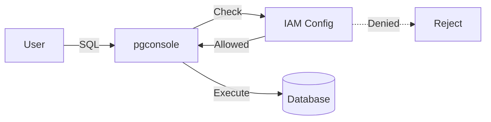

<Info>This feature requires the **Team** or **Enterprise** plan.</Info>

pgconsole provides fine-grained access control for your database connections. You define [IAM rules](/configuration/config#access-control-iam) in your configuration file, and pgconsole enforces them — rejecting unauthorized queries before they reach the database.



Unlike PostgreSQL's built-in role system (`GRANT`/`REVOKE`), pgconsole's access control operates at the application layer. You don't need to create database roles for each user — all users connect through shared credentials while pgconsole enforces per-user permissions, controls application-level features like export, and logs every action for [auditing](/features/audit-log).


Access control in pgconsole works on three principles:

- **Default deny** — users have no access unless a rule explicitly grants it
- **Connection-scoped** — permissions are granted per database connection, not globally
- **Disjoint permissions** — each permission level is independent; `write` does not imply `read`

When IAM is enabled, users only see connections they have at least one permission for. Connections without any matching rules are hidden entirely.

## Prerequisites

- [Authentication](/configuration/config#authentication) must be enabled; otherwise, all users get full access to all connections
- Users must be defined in [`[[users]]`](/configuration/config#users)
- Groups (if used) must be defined in [`[[groups]]`](/configuration/config#groups)

## Permission Levels

Independent permissions control what users can do:

| Permission | What It Controls | UI Elements Affected |
|------------|-----------------|---------------------|
| `read` | `SELECT`, `SHOW`, `SET` queries | Query execution |
| `write` | `INSERT`, `UPDATE`, `DELETE` | Inline row editing, add/delete rows, staged changes |
| `ddl` | `CREATE`, `ALTER`, `DROP`, `TRUNCATE`, `GRANT`, `REVOKE` | Edit function definitions |
| `admin` | Role/database management, `pg_terminate_backend` | Terminate sessions, cancel other users' queries |
| `explain` | `EXPLAIN` queries | Explain button in editor toolbar and context menu |
| `execute` | `CALL` stored procedures | Procedure execution |
| `export` | Export from results | Export button |

A single SQL statement can require multiple permissions. For example, `SELECT pg_terminate_backend(123)` requires both `read` (for the SELECT) and `admin` (for the function call).

The permission badge shows the user's permissions on each connection.


## Groups

Groups let you manage permissions for multiple users at once instead of listing individual emails in every IAM rule. Define groups in `pgconsole.toml` with [`[[groups]]` sections](/configuration/config#groups):

```toml pgconsole.toml
[[groups]]
id = "developers"
name = "Development Team"
members = ["alice@example.com", "bob@example.com"]

[[groups]]
id = "dba"
name = "Database Administrators"
members = ["admin@example.com"]
```

## Defining Rules

Each [`[[iam]]`](/configuration/config#access-control-iam) rule specifies a connection, a set of permissions, and a set of members.

```toml pgconsole.toml
[[iam]]
connection = "production"
permissions = ["explain", "read", "write"]
members = ["*"]
```

### Targeting Connections

| Value | Scope |
|-------|-------|
| `*` | All connections |
| `<connection-id>` | A specific connection |

### Targeting Members

| Format | Who It Matches |
|--------|---------------|
| `*` | Any authenticated user |
| `user:<email>` | A specific user |
| `group:<group-id>` | All members of a group |

### Granting Permissions

List individual permissions or use the shorthand:

```toml pgconsole.toml
# Specific permissions
permissions = ["read", "write", "explain", "export"]

# All permissions at once
permissions = ["*"]
```

## Common Patterns

### Read-Only Access for Everyone, Full Access for DBAs

```toml pgconsole.toml
[[iam]]
connection = "*"
permissions = ["read", "explain", "export"]
members = ["*"]

[[iam]]
connection = "*"
permissions = ["*"]
members = ["group:dba"]
```

### Environment-Based Access

```toml pgconsole.toml
# Developers: full access to dev, read-only on staging and prod
[[iam]]
connection = "development"
permissions = ["*"]
members = ["group:developers"]

[[iam]]
connection = "staging"
permissions = ["read", "explain"]
members = ["group:developers"]

[[iam]]
connection = "production"
permissions = ["read", "explain"]
members = ["group:developers"]

# DBAs: full access everywhere
[[iam]]
connection = "*"
permissions = ["*"]
members = ["group:dba"]
```

### Analyst with Export Access

```toml pgconsole.toml
[[iam]]
connection = "analytics"
permissions = ["read", "explain", "export"]
members = ["user:analyst@example.com"]
```

### Write Access on Staging Only

```toml pgconsole.toml
[[iam]]
connection = "*"
permissions = ["read"]
members = ["group:dev-team"]

[[iam]]
connection = "staging"
permissions = ["write"]
members = ["group:dev-team"]
```

Because permissions are a union of all matching rules, the dev team ends up with `read` on all connections and `read` + `write` on staging.
