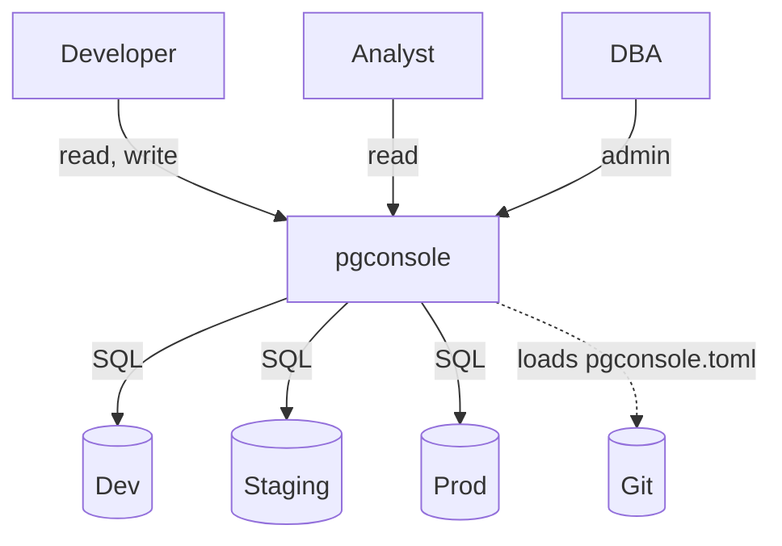

_From the makers of [Bytebase](https://www.bytebase.com), [pgschema](https://github.com/pgschema/pgschema), and [Google Cloud SQL for Postgres](https://cloud.google.com/sql/postgresql)._

pgconsole is a web-based PostgreSQL editor. Single binary, single config file, no database required. Connect your team to PostgreSQL with access control and audit logging built in.

## Fast

- Full PostgreSQL parser powers realtime autocomplete, syntax highlighting, and error detection
- Query, edit results, stage changes, and apply — all in one view
- AI assistant generates SQL, explains queries, fixes errors, and assesses change risk

## Secure

- Self-hosted and air-gapped ready — no outbound traffic except to your databases and optional AI provider
- Server-side connections — database credentials never reach individual users. No firewall exceptions, no bastion hosts
- Fine-grained IAM controls who can read, write, or administer each connection
- Every query and login is recorded in the audit log

## Work with Git

- Everything is in `pgconsole.toml` — connections, users, groups, access rules, AI providers
- No database, no migrations, no admin UI settings that drift between environments
- Review access control changes in PRs the same way you review code

## Use cases

### Team

- Credentials stay on the server, permissions enforced per user, every query logged
- Onboard new members by adding a line to `pgconsole.toml`, not by creating database roles
- Manage access control in Git — same review process as code changes

### Individual Developer

- A modern alternative to pgAdmin, DBeaver, or psql
- No account required, no Java runtime, no Electron — single binary that starts in seconds
- Autocomplete and error detection work on CTEs, subqueries, and window functions

### Bundle with Your Product (OEM)

- Add a database UI to any product that ships PostgreSQL
- No additional database, no separate user management
- Configure once in your deployment and it's ready for your customers

## Next steps

<Card title="Quickstart" icon="rocket" href="/getting-started/quickstart">
  Run your first query in minutes
</Card>
